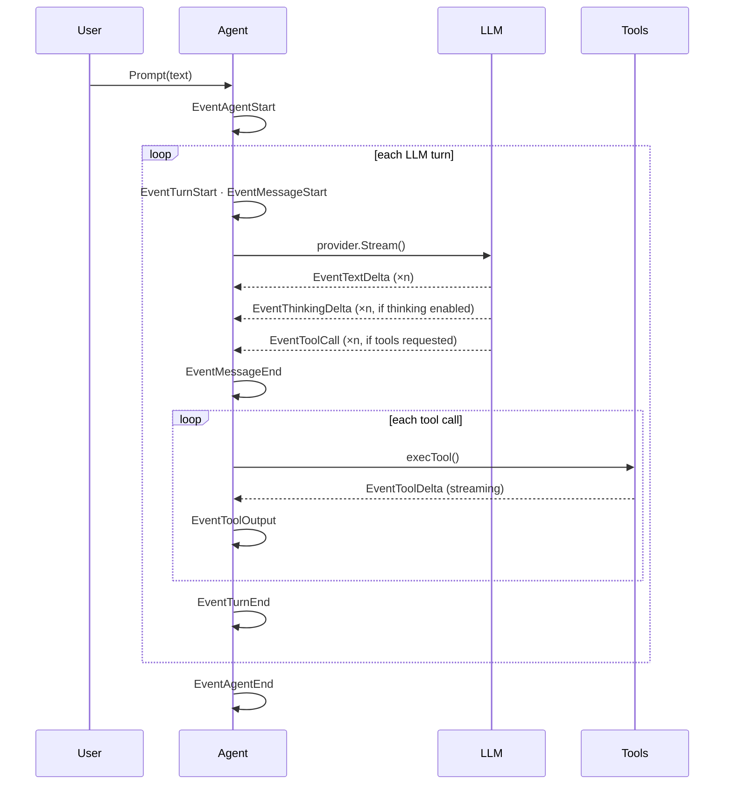
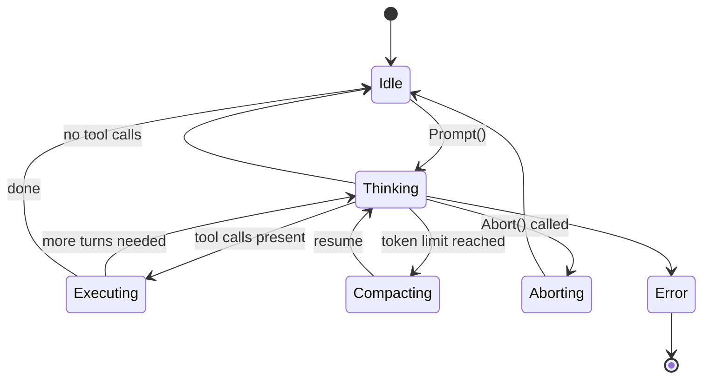

The agent is driven by an **event-bus** (`internal/events`). Every meaningful state transition emits an `agent.Event` to all subscribers.

---

## EventBus Performance

The EventBus is **async and non-blocking**. `Publish()` enqueues to a 4096-item buffered channel per subscriber and returns immediately — it never blocks the agent loop. Each subscriber runs in its own goroutine. Slow subscribers drop events to protect the agent loop from backpressure.

---

## Event Flow



---

## State Machine

The agent transitions through explicit states to prevent concurrent modification:



---

## Prompt Queues

Two queues support non-blocking interaction while the agent is running:

- **SteerQueue** — Injected as a user message at the next tool boundary (interrupt-style)
- **FollowUpQueue** — Processed as a new turn after the agent goes Idle

---

## Tool System

Tools implement a simple interface:

```go
type Tool interface {
    Name() string
    Description() string
    Schema() json.RawMessage
    Execute(ctx context.Context, args json.RawMessage, update ToolUpdate) (*ToolResult, error)
    IsReadOnly() bool
}
```

A `ToolRegistry` holds all registered tools. During a turn, when the LLM emits a tool call, `execTool` looks up the tool by name, executes it, and streams partial output via `EventToolDelta` before emitting the final `EventToolOutput`.

**Built-in tools:** `read`, `write`, `edit`, `bash`, `grep`, `ls`, `find`

### Safety Enforcements

- **Dry-Run Mode**: When `DryRun` is enabled, any tool that is not marked as read-only will bypass execution and return a descriptive preview of what it *would* have done.
- **Input Sanitization**: Prompt template expansion automatically wraps user inputs in `<untrusted_input>` tags to prevent prompt injection into the base instructions.
