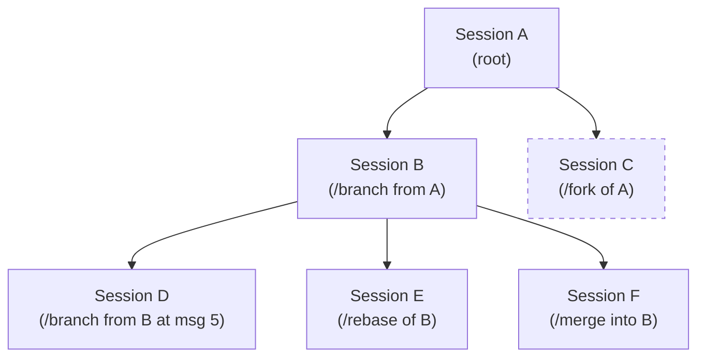
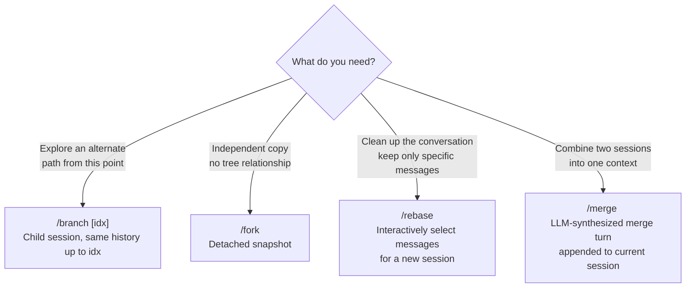

Sessions are persisted as **JSONL files** in a project-aware directory:

```
~/.sharur/sessions/
  --Users-alice-Projects-myapp--/     ← sanitized CWD
    2026-04-23T07-06-54_{uuid}.jsonl  ← timestamped session file
    2026-04-23T09-12-11_{uuid}.jsonl
```

---

## Session File Format

Each `.jsonl` file contains one JSON object per line:

- **Line 0 (header)**: `kind=header` — session ID, parentId, model, timestamps, system prompt, compaction settings, dryRun flag
- **Subsequent lines**: `kind=message` — individual conversation messages with full payloads (role, content, thinking, tool calls, tool call ID)

---

## Session Tree

Sessions form a **linked tree** via `parentId`. The `session.Manager.BuildTree()` method assembles all sessions from the project directory into a `[]*TreeNode` tree. `FlattenTree` produces a depth-first flat list with structured layout metadata (gutters, connectors, indentation), which the TUI layer uses to render a clean Unicode box-drawing tree diagram.



`/fork` creates an independent copy (dashed border above) with no `parentId` link — it does not appear as a child in the tree visualization.

---

## Branching, Rebasing & Merging



| Command | Creates parent link | Copies history | Interactive |
|---|:---:|:---:|:---:|
| `/branch [idx]` | ✓ | up to `idx` | ✗ |
| `/fork` | ✗ | full | ✗ |
| `/rebase` | ✓ | selected messages | ✓ |
| `/merge <id>` | ✗ | appends other session | LLM turn |

The `/tree` modal (keyboard shortcut `B`, `F`, `R` on a selected session) exposes all of these without leaving the TUI.

---

## Compaction & Context Management

To stay within LLM context windows, `sharur` implements an auto-compaction strategy:

1. **Trigger**: When `tokens > ContextWindow - reserveTokens`, compaction fires.
2. **Summarization**: The agent uses the LLM to generate a structured summary (`<!-- sharur-summary -->`) of the pruned messages.
3. **File Tracking**: The summary carries forward lists of files read and modified, so the assistant retains awareness of what it has already seen.
4. **Split Turn Handling**: If compaction cuts mid-turn, a "Turn Prefix Summary" is generated to preserve context for the remaining tool calls.
5. **Session Tree Integration**: Compaction events are stored as `TypeCompaction` records in the JSONL file, visible in `/stats` and preserved across restarts.

### Compaction Configuration

```jsonc
// ~/.sharur/config.json or .sharur/config.json
{
  "compaction": {
    "enabled": true,
    "reserveTokens": 2048,
    "keepRecentTokens": 8192
  }
}
```

| Field | Default | Description |
|---|---|---|
| `enabled` | `true` | Whether auto-compaction fires when the token budget is exceeded |
| `reserveTokens` | `2048` | Tokens to keep free at the top of the context window; compaction triggers when `used > window - reserveTokens` |
| `keepRecentTokens` | `8192` | Minimum recent-turn tokens to always retain after compaction, ensuring the current conversation thread survives |

Trigger compaction manually at any time with `/compact` in the TUI or by calling the `Compact` RPC directly.

---

## Export & Import

Sessions can be exported to and imported from JSONL files:

```bash
# Export from TUI
/export /path/to/session.jsonl

# Import into TUI (creates a new session from the file)
/import /path/to/session.jsonl

# Export from CLI without entering TUI
shr --export /path/to/session.html   # HTML snapshot
```

Exported JSONL files are self-contained: they include the session header and all messages. Imported sessions are assigned a new UUID and added to the current project's session directory.
