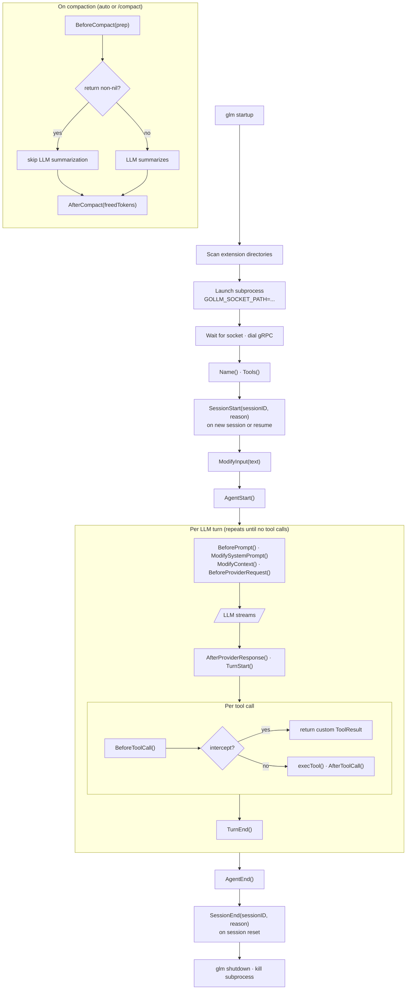

Extensions let you add new behaviors to `gollm` beyond what's possible with skills and prompt templates. They can observe and modify every stage of the agent loop — from the raw user input through each LLM turn and tool call to compaction and session teardown. Extensions run as separate processes and communicate with `gollm` via gRPC.

---

## Extension Types

| Type | Language | Use Case |
|---|---|---|
| **Go binary** | Go | High-performance tools, direct filesystem access |
| **Python script** | Python | Data processing, ML integrations, API calls |
| **Any executable** | Any | Shell scripts, compiled binaries from any language |

All extension types use the same gRPC protocol. The loader treats `.py` files specially (runs them with the configured Python interpreter), and everything else is executed directly as a binary.

---

## Extension Discovery

Extensions are loaded from directories listed in your config under `extensions`:

```jsonc
// .gollm/config.json
{
  "extensions": [".gollm/extensions"]
}
```

Or globally in `~/.gollm/config.json`.

Place your extension binary or script in the configured directory. `gollm` will automatically discover and launch it on startup.

You can also load a specific extension at runtime with the `--extension` flag:

```bash
glm --extension /path/to/my-extension "Your prompt here"
```

---

## The Plugin Interface

Every Go extension implements the `extensions.Plugin` interface from `github.com/goppydae/gollm/extensions`. Embed `extensions.NoopPlugin` and override only the hooks you need.

### Load-time hooks

| Method | When called | Purpose |
|---|---|---|
| `Name()` | On load | Returns the extension's identifier string |
| `Tools()` | On load | Returns tool definitions the agent can call |
| `ExecuteTool()` | On tool call | Executes a tool registered by this extension |

### Session lifecycle hooks

| Method | When called | Purpose |
|---|---|---|
| `SessionStart(ctx, sessionID, reason)` | Session attached or first prompt | Open connections, initialize per-session state |
| `SessionEnd(ctx, sessionID, reason)` | Session reset | Flush buffers, close connections |

`reason` is `"new"` for a fresh session and `"resume"` for one loaded from disk.

### Agent loop hooks

| Method | When called | Purpose |
|---|---|---|
| `AgentStart(ctx)` | User prompt received, loop begins | Per-prompt setup, logging |
| `AgentEnd(ctx)` | Agent loop completes | Per-prompt teardown, emit metrics |
| `TurnStart(ctx)` | Start of each LLM request turn | Per-turn timing |
| `TurnEnd(ctx)` | After each turn's tool calls finish | Per-turn cleanup |

### Transformation hooks

| Method | When called | Can modify | Purpose |
|---|---|---|---|
| `ModifyInput(ctx, text)` | Before user text hits the transcript | Yes — transform or consume | Pre-process input, implement shortcuts |
| `ModifySystemPrompt(prompt)` | Before each LLM request | Yes — returns new prompt | Inject dynamic context into the system prompt |
| `BeforePrompt(ctx, state)` | Before each LLM request | Yes — returns new state | Change model, provider, or thinking level |
| `ModifyContext(ctx, messagesJSON)` | Before each LLM request is built | Yes — returns new JSON | Filter or inject messages sent to the LLM (transcript unchanged) |
| `BeforeProviderRequest(ctx, requestJSON)` | Just before the request is sent | Yes — returns new JSON | Modify temperature, max tokens, tools list |
| `AfterProviderResponse(ctx, content, numToolCalls)` | After LLM stream consumed | No | Observe response text and tool call count |
| `BeforeToolCall(ctx, call, args)` | Before each tool execution | Yes — can intercept | **Block or replace tool execution** |
| `AfterToolCall(ctx, call, result)` | After each tool execution | Yes — returns new result | Observe or modify tool results |
| `BeforeCompact(ctx, prep)` | Before LLM-based summarization | Yes — can skip | **Provide a custom compaction summary** |
| `AfterCompact(ctx, freedTokens)` | After compaction completes | No | Observe freed token count |

Key behaviors:
- **`ModifyInput`** returns `agent.InputResult`. Set `Action` to `"continue"` (pass through unchanged), `"transform"` (use the `Text` field instead), or `"handled"` (consume the message entirely — it is not appended to the transcript and the agent does not run).
- **`ModifyContext`** and **`BeforeProviderRequest`** work with JSON strings at the gRPC boundary. The `GRPCClient` marshals/unmarshals the Go structs automatically.
- **`BeforeCompact`** returns `""` (empty) to let the default LLM summarization run, or a non-empty summary string to provide your own and skip the LLM call. The `prep` argument includes the message count, estimated token count, and the previous summary (if any).
- **`BeforeToolCall`** returns `(ToolResult, true)` to intercept (the tool does not execute), or `(ToolResult{}, false)` to allow normal execution.

---

## Example: Git Context Injection

```go
// .gollm/extensions/git-context/main.go
package main

import (
    "context"
    "fmt"
    "os/exec"
    "strings"

    "github.com/goppydae/gollm/extensions"
)

type GitContextPlugin struct {
    extensions.NoopPlugin
}

func (p *GitContextPlugin) BeforePrompt(_ context.Context, state extensions.AgentState) extensions.AgentState {
    branch := gitOutput("rev-parse", "--abbrev-ref", "HEAD")
    status := gitOutput("status", "--short")
    log := gitOutput("log", "--oneline", "-5")

    state.SystemPrompt += fmt.Sprintf(
        "\n\n<git_context>\nBranch: %s\n\nRecent commits:\n%s\n\nWorking tree:\n%s\n</git_context>",
        branch, log, status,
    )
    return state
}

func gitOutput(args ...string) string {
    out, err := exec.Command("git", args...).Output()
    if err != nil {
        return "(unavailable)"
    }
    return strings.TrimSpace(string(out))
}

func main() {
    extensions.Serve(&GitContextPlugin{
        NoopPlugin: extensions.NoopPlugin{NameStr: "git-context"},
    })
}
```

Build and auto-discover:

```bash
cd .gollm/extensions/git-context && go build -o ../git-context .
```

---

## Example: Session Lifecycle Hooks

```go
type AuditPlugin struct {
    extensions.NoopPlugin
    log *os.File
}

func (p *AuditPlugin) SessionStart(_ context.Context, sessionID string, reason agent.SessionStartReason) {
    p.log, _ = os.OpenFile(fmt.Sprintf("/tmp/gollm-%s.log", sessionID[:8]), os.O_CREATE|os.O_APPEND|os.O_WRONLY, 0644)
    fmt.Fprintf(p.log, "session %s (%s)\n", sessionID, reason)
}

func (p *AuditPlugin) SessionEnd(_ context.Context, sessionID string, _ agent.SessionEndReason) {
    if p.log != nil {
        p.log.Close()
    }
}

func (p *AuditPlugin) AfterProviderResponse(_ context.Context, content string, numToolCalls int) {
    fmt.Fprintf(p.log, "response: %d chars, %d tool calls\n", len(content), numToolCalls)
}
```

---

## Example: Input Transformation

`ModifyInput` runs before the user text is added to the transcript. Return `"handled"` to consume shortcuts silently, or `"transform"` to rewrite the text:

```go
func (p *MyPlugin) ModifyInput(_ context.Context, text string) agent.InputResult {
    if strings.HasPrefix(text, "?quick ") {
        return agent.InputResult{
            Action: agent.InputTransform,
            Text:   "Respond in one sentence: " + text[7:],
        }
    }
    if text == "ping" {
        return agent.InputResult{Action: agent.InputHandled}
    }
    return agent.InputResult{Action: agent.InputContinue}
}
```

---

## Example: Custom Compaction

Return a non-nil `*agent.CompactionResult` from `BeforeCompact` to supply your own summary and bypass the default LLM-based summarization:

```go
func (p *MyPlugin) BeforeCompact(_ context.Context, prep agent.CompactionPrep) *agent.CompactionResult {
    if prep.EstimatedTokens < 50000 {
        return nil
    }
    summary := callCheaperModel(prep.PreviousSummary, prep.MessageCount)
    return &agent.CompactionResult{
        Summary: summary,
    }
}
```

---

## Example: Extension with Custom Tools

Extensions can contribute tools the agent calls just like built-in tools:

```go
type CounterPlugin struct {
    extensions.NoopPlugin
}

func (p *CounterPlugin) Tools() []extensions.ToolDefinition {
    return []extensions.ToolDefinition{
        {
            Name:        "count_lines",
            Description: "Count lines in a string",
            Schema:      json.RawMessage(`{"type":"object","properties":{"text":{"type":"string"}},"required":["text"]}`),
            IsReadOnly:  true,
        },
    }
}

func (p *CounterPlugin) ExecuteTool(_ context.Context, name string, args json.RawMessage) extensions.ToolResult {
    if name != "count_lines" {
        return extensions.ToolResult{Content: "unknown tool", IsError: true}
    }
    var input struct{ Text string `json:"text"` }
    _ = json.Unmarshal(args, &input)
    n := strings.Count(input.Text, "\n") + 1
    return extensions.ToolResult{Content: fmt.Sprintf("%d lines", n)}
}
```

---

## Example: Intercepting Tool Calls (Sandbox)

`BeforeToolCall` lets you block or replace any built-in tool call:

```go
type SandboxPlugin struct {
    extensions.NoopPlugin
    AllowedDir string
}

func (p *SandboxPlugin) BeforeToolCall(_ context.Context, call extensions.ToolCall, args json.RawMessage) (extensions.ToolResult, bool) {
    var input struct{ Path string `json:"path"` }
    _ = json.Unmarshal(args, &input)
    if input.Path != "" && !strings.HasPrefix(input.Path, p.AllowedDir) {
        return extensions.ToolResult{
            Content: fmt.Sprintf("blocked: %s is outside %s", input.Path, p.AllowedDir),
            IsError: true,
        }, true
    }
    return extensions.ToolResult{}, false
}
```

See [`examples/sandbox/`](https://github.com/goppydae/gollm/tree/main/examples/sandbox) for a complete standalone implementation.

---

## Extension Lifecycle



---

## In-Process Go Extension (Advanced)

If your extension is written in Go and you control the build, you can implement `agent.Extension` directly via the SDK and register it without the gRPC overhead:

```go
import (
    "github.com/goppydae/gollm/internal/agent"
    "github.com/goppydae/gollm/internal/tools"
)

type MyExtension struct {
    agent.NoopExtension
}

func (e *MyExtension) AgentStart(ctx context.Context) {
    log.Println("agent started")
}

func (e *MyExtension) ModifyInput(ctx context.Context, text string) agent.InputResult {
    if text == "ping" {
        return agent.InputResult{Action: agent.InputHandled}
    }
    return agent.InputResult{Action: agent.InputContinue}
}

func (e *MyExtension) ModifySystemPrompt(prompt string) string {
    return prompt + "\n\nAlways respond in bullet points."
}

func (e *MyExtension) BeforeToolCall(ctx context.Context, call *agent.ToolCall, args json.RawMessage) (*tools.ToolResult, bool) {
    if call.Name == "bash" {
        return &tools.ToolResult{Content: "bash is disabled", IsError: true}, true
    }
    return nil, false
}
```

Pass the extension via `ag.SetExtensions()` from the SDK or directly in `cmd/glm`.

---

## Tips

- **Extensions are isolated processes.** A crash in an extension will not crash `gollm` — the loader catches errors and logs them.
- **Keep `BeforePrompt` and `ModifySystemPrompt` fast.** They run before every single LLM call. Cache data when possible; avoid blocking network calls.
- **`ModifyContext` does not affect the stored transcript.** Changes to the message slice are only visible to the LLM for that turn.
- **Use skills for static context.** If you only need to append static text to the system prompt, a skill is simpler than an extension.
- **Extensions are global.** All extensions in the configured directories are loaded for every session. There is no per-project scoping beyond the directory config.
- **Logs go to stderr.** Stdout is not read by the host; stderr is passed through for debugging.
- **`InputHandled` stops all further processing.** No agent turn is started, no message is appended to the transcript.
- **`BeforeCompact` fires before the LLM call.** Return `nil` to let the default summarizer run. Return a `*CompactionResult` to supply your own summary — useful for using a cheaper model or domain-specific logic.
