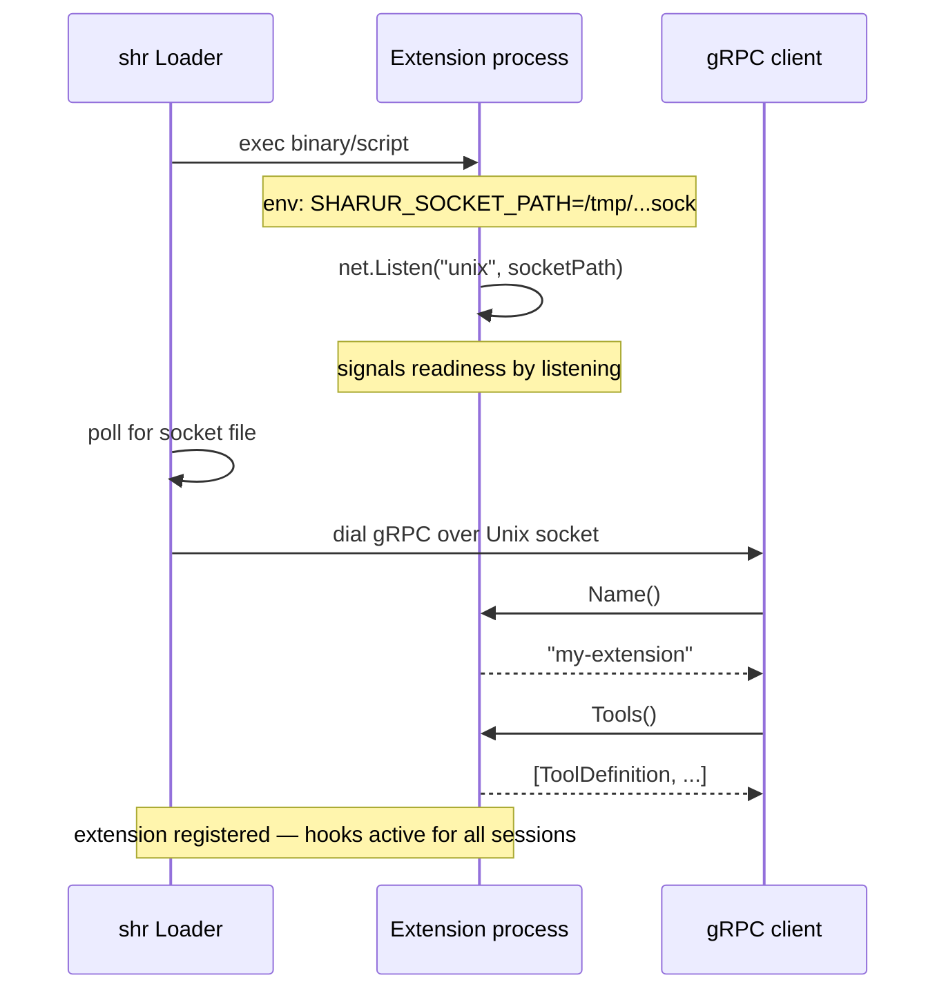

gRPC extensions run as separate processes. `sharur` manages their lifecycle: launching the binary, passing the socket path, waiting for readiness, dialing, and killing on shutdown. The extension communicates entirely over a Unix Domain Socket using the generated proto stubs in `extensions/proto/extension.proto`.

---

## How It Works



The extension must call `net.Listen("unix", os.Getenv("SHARUR_SOCKET_PATH"))` and start serving before `shr` times out.

---

## Writing a Go Extension

Import `github.com/goppydae/sharur/extensions` — no internal packages needed.

```go
package main

import "github.com/goppydae/sharur/extensions"

type myPlugin struct {
    extensions.NoopPlugin
}

func (p *myPlugin) ModifySystemPrompt(prompt string) string {
    return prompt + "\n\nAlways respond in haiku."
}

func main() {
    extensions.Serve(&myPlugin{
        NoopPlugin: extensions.NoopPlugin{NameStr: "haiku"},
    })
}
```

`extensions.Serve` handles the socket path, gRPC server setup, and graceful shutdown. `extensions.NoopPlugin` provides no-op defaults for every method.

Build and place the binary in a configured extensions directory:

```bash
go build -o .sharur/extensions/haiku .
```

Or load at runtime:

```bash
shr --extension .sharur/extensions/haiku
```

---

## Plugin Interface

All hooks map 1:1 to `agent.Extension`. See [Go Extensions](/user/extensibility/extensions-go/) for full hook semantics and examples.

**Load-time:**

| Method | Called | Purpose |
|---|---|---|
| `Name()` | Once on connect | Extension identifier |
| `Tools()` | Once on connect | Contribute tools to the agent |
| `ExecuteTool()` | Per tool call | Execute a registered tool |

**Session lifecycle:**

| Method | Called | Purpose |
|---|---|---|
| `SessionStart(ctx, sessionID, reason)` | New or resumed session | Open connections, init per-session state |
| `SessionEnd(ctx, sessionID, reason)` | Session reset | Flush, close connections |

`reason` is `"new"` or `"resume"`.

---

## Proto Definition

The extension service is defined in `extensions/proto/extension.proto`. Generated Go stubs are in `extensions/gen/`. Regenerate with `mage generate`.

Python stubs can be generated with:

```bash
python -m grpc_tools.protoc \
  -I extensions/proto \
  --python_out=.sharur/extensions \
  --grpc_python_out=.sharur/extensions \
  extensions/proto/extension.proto
```

---

## Tool Read-Only Semantics

Tool definitions returned by `Tools()` have an `IsReadOnly bool` field. Set it to `true` for tools that are safe in dry-run mode. The `GRPCClient` propagates this to the internal `RemoteTool.IsReadOnly()` so dry-run and sandbox extensions honour it correctly.

---

## Debugging

- **Logs go to stderr.** The host passes the subprocess's stderr through. Use `log.Println` or `fmt.Fprintln(os.Stderr, ...)` for debug output.
- **Crashes are isolated.** A panicking extension does not crash `shr` — the loader catches errors and logs them.
- **Socket timeout.** If the extension doesn't listen within the timeout, the loader logs an error and skips it. Ensure `extensions.Serve` (or your own `net.Listen` + `grpc.Serve`) is called promptly in `main()`.
- **Test in isolation.** Set `SHARUR_SOCKET_PATH=/tmp/test.sock` and run your extension binary directly; then `grpcurl` the socket to verify RPCs before integrating with `shr`.
